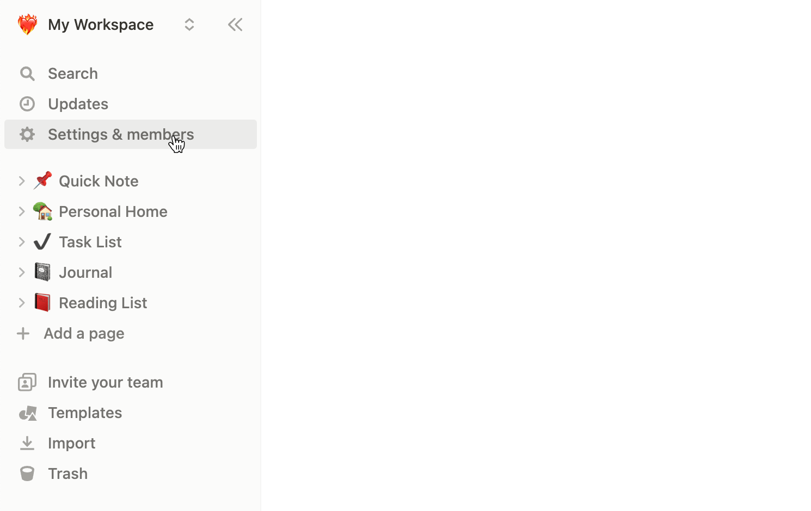
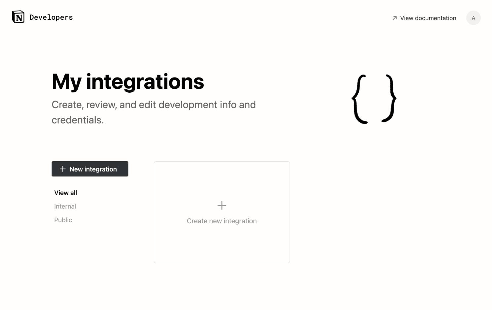
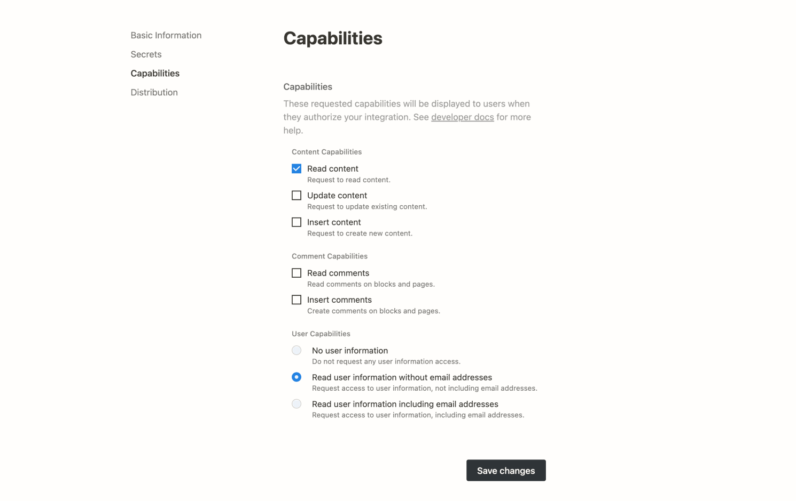
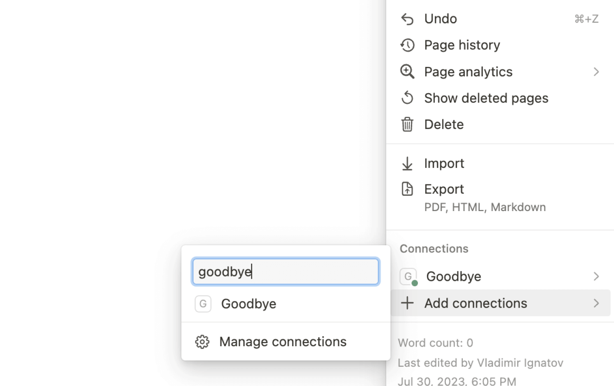

# Import & Export

You can import or export from your space by navigating to **Anytype > Space Settings > Import / Export Space**. Alternatively, you can simply type “Import” in the Search Menu.
### Supported Imports
Currently, we support imports from:
- **Notion API**
  Please refer to the [instructions](#notion-import-step-by-step-guide) for details on how to import using the Notion API.
### Supported File Formats
When it comes to file formats, we currently offer support for importing the following:
- **MD (Markdown)**: You can import individual `.md` files or a zip file containing multiple Markdown files. Please note that relations are not exported at this time.
- **HTML**
- **TXT**
- **CSV**
- **Any-Block**:
  - **Protobuf**
  - **JSON**


Because not all Notion features are present in Anytype yet, some Notion data might not end up being imported properly.


After your import is done, a new collection should appear in your favorites widget in your sidebar. All of your imported objects should be there.

When it comes to export formats, we currently offer **Markdown** and **Any-Block** (both Protobuf and JSON).

### Notion import FAQ

Why do I see "page not found" instead of links after importing from Notion to Anytype?

This issue occurs when you have links to pages that are not nested within your Notion workspace structure. These pages may not have been properly connected to the integration during the import, leading to broken links in Anytype.

**Solution:**
- **Check Page Connections:** Ensure that all pages in your Notion workspace are connected before starting the import process. If a page is not properly connected to the integration, it may not import correctly. See the Step-by-Step Guide within the app for details.
- **Repeat the import:** If a page did not import, add a missing Connection and repeat the import.

Why are some files missing after importing from Notion to Anytype?

There are two main reasons for missing files:
1. **Missing Connection:** Make sure that the page containing the files in Notion is properly connected to the integration before import. If this connection is missing, the files may not be imported.
2. **Slow Internet Connection:** If you have a slow internet connection and a large number of files, the links to these files might expire during the download process, resulting in missing files.

**Solution:**
- **Ensure Proper Connection:** Double-check that all pages and their respective files are connected in Notion before importing.
- **Use a Faster Internet Connection:** If possible, use a faster internet connection during the import process to prevent link expiration.
- **Manually Add Missing Files:** If files are missing after the import, you may need to manually upload them to Anytype.

Why did the Notion import to Anytype take so long?

The import process uses the Notion API to ensure data is transferred as accurately as possible. This method, though more reliable than exporting to Markdown, requires multiple queries. Over time, Notion may start rate-limiting these queries, leading to delays.

**Solution:**
- **Plug in Your Device:** Make sure your computer is plugged into a power source during the import.
- **Disable Sleep Mode:** Prevent your computer from going to sleep to allow the import process to continue uninterrupted.
- **Be Patient:** Allow the import process to run until it completes. It may take some time, especially if there is a large amount of data.

I have some other problem with Notion import, or I no longer have access to my Notion workspace

If you encounter issues with the Notion import (which works via the Notion API) or you lose access to your Notion workspace, you can export your workspace from Notion as Markdown & CSV files and import them into Anytype using the Markdown import option.

 
Markdown Import is More Lossy: Be aware that importing via Markdown & CSV files is more lossy compared to using the Notion API. This is because Notion’s way of linking documents and CSV files may not be fully preserved in the Markdown format, potentially leading to loss of structure or links between documents.


**Solution:**
- **Export from Notion:** In your Notion workspace, export your data as Markdown & CSV files.
- **Import into Anytype:** Use Anytype’s Markdown import feature to bring the exported content into your Anytype workspace.

### Notion import step-by-step guide

Steps

#### Step 1

1. **Open Settings & members.**  
   

2. **Open My Connections and then click Develop or manage integrations.**  
   

3. **Click New integration or Create new integration.**  
   

4. **Select your workspace and set Name for integration.**  
   

5. **Important!**  
   Go to **Capabilities** and select the following capabilities, then press **Save changes**:
  - Read content
  - Read user information  
    

6. **Copy Internal Integration Secret** for connecting and importing your data.  
   

#### Step 2

**Add integration to the pages you want to import into Anytype.** Pages will be imported with all children documents. Select your root object to import all objects.

1. **Click on three dots in the upper right corner, then click Connect to (you may need to scroll the menu).** Select your Anytype integration.  
   

2. **Press Confirm.** Now, you just need to paste your Internal Integration Token into Anytype.  
   

